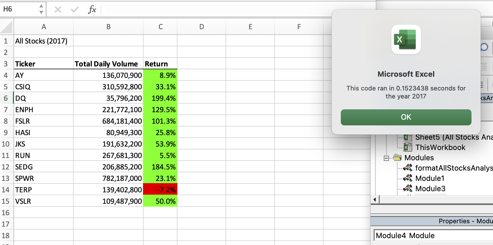

# Stock-Analysis

## Overview of Project

The purpose of this project is to provide the client (Steve) with a tool that will allow for analyzing a data set of stock market data.  The goal is to take the stock market data set of stocks from the overall market and produce a list of each equity and calculate the total daily volume and percentage of return for each stock for  each annual time period obtained.  

## Background
This analysis utilizes Microsoft Visual Basic for Applications (VBA) within the Excel spreadsheet program.  The analysis reads and reviews multiple stocks and there associated open and closing prices, daily trade volumes and dates of activity.  The data is then analysed with a VBA script to input and handle the data set, and outputs the results on a spreadsheet with column headers and results in an easily readable and manageble format. 

## Results
The stock analysis was run for both 2017 and 2018 years for all stocks in the data set in order to compare the stock performance results for each year.  This data set of stocks included 13 equities and the code included a header using the `Cells` function to present the results of of analysis with a head of Ticker, Total Daily Volumes and Return by percent for each stock symblol.  The VBA code also used a `string` of `arrays` of all stock tickers with variables `Dim` for starting and ending prices.  Use of loops, such as `for loops` and `nested loops` were utilized to loop through all of the ticker symbols.  Nested loops were used to loop thru the rows of data, and `If Then Else` statements were applied to find the total volume and starting and ending prices of all the stock tickers.  The output of the analsis of data to a new worksheet was done with the `worksheet.activate` method.  Then the ouput column for all stock percentage gains was highlighted in green with `Cells(i, 3.Interior.Color = vbGreen` for an increase in value change from year to year, or highlighted in red for a decrease for the same period. 

### Anaysis Execution Times
For tracking of the time the code ran, the Timer function was used `startTime = Timer` at the begining of the code just after the user inputs the desired year of analysis to run.  The `endTime = Timer` function terminated the time the code ran and a message box was used to show the resulting run times.  This code was `MsgBox "this code ran in " & (endTime - startTime) & " seconds for the year " & (yearValue)`.  See the screenshot images below of the time in seconds the code ran for both years. 

## Summary

### Refactoring the code. 

### Advantages

of Refactoring code

### Disadvantages

